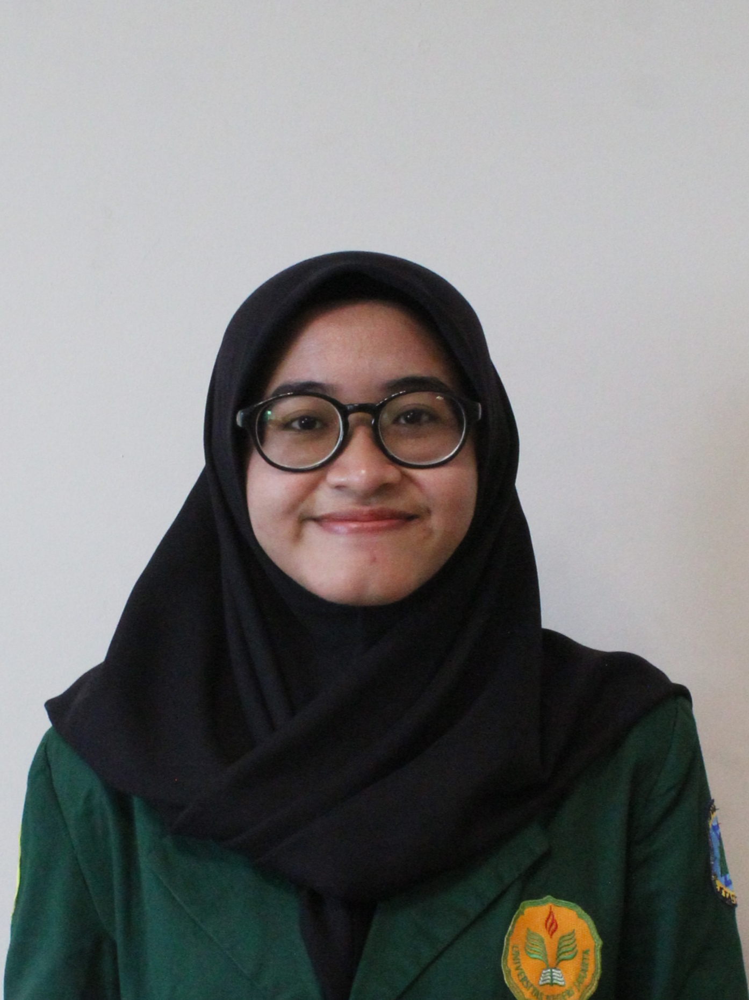

```{=html}
<!-- ── HERO / ABOUT ─────────────────────────────────── -->
<div style="display:flex; gap:3rem; align-items:flex-start; max-width:860px; margin:4rem auto 0; padding:0 2rem; flex-wrap:wrap;">

  <div style="flex-shrink:0; text-align:center;">
    
    <div style="margin-top:1.25rem; display:flex; flex-direction:column; gap:0.5rem;">
      <a href="https://linkedin.com/in/nisrinaalissy" 
         style="font-family:'JetBrains Mono',monospace; font-size:11px; letter-spacing:0.07em; text-transform:uppercase; color:#c4a252; background:rgba(196,162,82,0.1); border:1px solid rgba(196,162,82,0.25); padding:6px 14px; display:flex; align-items:center; gap:6px; justify-content:center;">
        <i class="bi bi-linkedin"></i> LinkedIn
      </a>
      <a href="https://github.com/alissysays"
         style="font-family:'JetBrains Mono',monospace; font-size:11px; letter-spacing:0.07em; text-transform:uppercase; color:#c4a252; background:rgba(196,162,82,0.1); border:1px solid rgba(196,162,82,0.25); padding:6px 14px; display:flex; align-items:center; gap:6px; justify-content:center;">
        <i class="bi bi-github"></i> GitHub
      </a>
      <a href="mailto:alissy.nisrina@gmail.com"
         style="font-family:'JetBrains Mono',monospace; font-size:11px; letter-spacing:0.07em; text-transform:uppercase; color:#c4a252; background:rgba(196,162,82,0.1); border:1px solid rgba(196,162,82,0.25); padding:6px 14px; display:flex; align-items:center; gap:6px; justify-content:center;">
        <i class="bi bi-envelope"></i> Email
      </a>
    </div>
  </div>

  <div style="flex:1; min-width:260px;">
    <p style="font-family:'JetBrains Mono',monospace; font-size:10px; letter-spacing:0.18em; text-transform:uppercase; color:#c4a252; opacity:0.65; margin-bottom:0.5rem;">// about me</p>
    <h1 style="font-family:'DM Serif Display',serif; font-size:38px; font-weight:400; color:#f0ebe0; margin-bottom:1rem;">Nisrina Alissy</h1>
    <p style="color:#9a9588; font-size:15px; line-height:1.85; margin-bottom:1.5rem; max-width:100%;">
      Hi, I'm <strong style="color:#f0ebe0;">Alissy</strong> — undergraduate Statistics student at UNJ. 
      I'm interested in data science, machine learning, and statistical analysis, 
      currently exploring R and Python to solve data-driven business problems.
    </p>

    <p style="font-family:'JetBrains Mono',monospace; font-size:10px; letter-spacing:0.18em; text-transform:uppercase; color:#c4a252; opacity:0.65; margin-bottom:0.75rem;">// skills</p>
    <div style="margin-bottom:0.6rem;">
      <span style="color:#f0ebe0; font-size:13px; font-weight:500;">Programming</span>
      <div style="margin-top:0.35rem; display:flex; gap:0.4rem; flex-wrap:wrap;">
        <span style="font-family:'JetBrains Mono',monospace; font-size:10px; color:#c4a252; background:rgba(196,162,82,0.08); border:1px solid rgba(196,162,82,0.2); padding:3px 9px;">R</span>
        <span style="font-family:'JetBrains Mono',monospace; font-size:10px; color:#c4a252; background:rgba(196,162,82,0.08); border:1px solid rgba(196,162,82,0.2); padding:3px 9px;">Python</span>
        <span style="font-family:'JetBrains Mono',monospace; font-size:10px; color:#c4a252; background:rgba(196,162,82,0.08); border:1px solid rgba(196,162,82,0.2); padding:3px 9px;">SQL</span>
      </div>
    </div>
    <div>
      <span style="color:#f0ebe0; font-size:13px; font-weight:500;">Tools</span>
      <div style="margin-top:0.35rem; display:flex; gap:0.4rem; flex-wrap:wrap;">
        <span style="font-family:'JetBrains Mono',monospace; font-size:10px; color:#9a9588; background:rgba(154,149,136,0.07); border:1px solid rgba(154,149,136,0.15); padding:3px 9px;">Microsoft Excel</span>
        <span style="font-family:'JetBrains Mono',monospace; font-size:10px; color:#9a9588; background:rgba(154,149,136,0.07); border:1px solid rgba(154,149,136,0.15); padding:3px 9px;">RStudio</span>
        <span style="font-family:'JetBrains Mono',monospace; font-size:10px; color:#9a9588; background:rgba(154,149,136,0.07); border:1px solid rgba(154,149,136,0.15); padding:3px 9px;">Google Colab</span>
      </div>
    </div>
  </div>
</div>

<!-- ── DIVIDER ───────────────────────────────────────── -->
<div style="max-width:860px; margin:3.5rem auto 0; padding:0 2rem;">
  <hr style="border:none; border-top:1px solid rgba(196,162,82,0.15); margin:0;">
</div>

<!-- ── FEATURED PROJECTS ─────────────────────────────── -->
<div style="max-width:860px; margin:3.5rem auto; padding:0 2rem;">

  <p style="font-family:'JetBrains Mono',monospace; font-size:10px; letter-spacing:0.18em; text-transform:uppercase; color:#c4a252; opacity:0.65; margin-bottom:0.5rem;">// selected work</p>
  <div style="display:flex; justify-content:space-between; align-items:baseline; margin-bottom:2rem;">
    <h2 style="font-family:'DM Serif Display',serif; font-size:28px; font-weight:400; color:#f0ebe0; margin:0;">Featured Projects</h2>
    <a href="projects.qmd" style="font-family:'JetBrains Mono',monospace; font-size:11px; letter-spacing:0.07em; text-transform:uppercase; color:#c4a252; opacity:0.8;">View all →</a>
  </div>

  <!-- Card 1 — Featured (full width) -->
  <a href="projects.qmd" style="text-decoration:none; display:block; margin-bottom:1.25rem;">
    <div style="background:#111827; border:1px solid rgba(196,162,82,0.18); padding:1.75rem; position:relative; overflow:hidden; transition:border-color 0.25s;"
         onmouseover="this.style.borderColor='rgba(196,162,82,0.4)'; this.querySelector('.bar').style.height='100%';"
         onmouseout="this.style.borderColor='rgba(196,162,82,0.18)'; this.querySelector('.bar').style.height='0';">
      <div class="bar" style="position:absolute; top:0; left:0; width:3px; height:0; background:#c4a252; transition:height 0.3s;"></div>
      <div style="display:grid; grid-template-columns:1fr 1fr; gap:2rem; align-items:start;">
        <div>
          <div style="margin-bottom:0.75rem;">
            <span style="font-family:'JetBrains Mono',monospace; font-size:10px; color:#c4a252; background:rgba(196,162,82,0.08); border:1px solid rgba(196,162,82,0.2); padding:3px 9px; letter-spacing:0.06em; text-transform:uppercase; margin-right:4px;">Statistics</span>
            <span style="font-family:'JetBrains Mono',monospace; font-size:10px; color:#c4a252; background:rgba(196,162,82,0.08); border:1px solid rgba(196,162,82,0.2); padding:3px 9px; letter-spacing:0.06em; text-transform:uppercase;">Machine Learning</span>
          </div>
          <h3 style="font-family:'DM Serif Display',serif; font-size:20px; font-weight:400; color:#f0ebe0; margin-bottom:0.75rem; line-height:1.3;">Logistic Regression Dashboard</h3>
          <p style="color:#9a9588; font-size:13px; line-height:1.75; margin:0;">
            Dashboard interaktif berbasis Shiny untuk eksplorasi model regresi logistik. 
            Pengguna dapat mengatur parameter model dan melihat hasil klasifikasi secara real-time.
          </p>
        </div>
        <div>
          <div style="margin-bottom:0.75rem;">
            <span style="font-family:'JetBrains Mono',monospace; font-size:10px; color:#9a9588; background:rgba(154,149,136,0.07); border:1px solid rgba(154,149,136,0.15); padding:3px 9px; margin-right:4px;">R</span>
            <span style="font-family:'JetBrains Mono',monospace; font-size:10px; color:#9a9588; background:rgba(154,149,136,0.07); border:1px solid rgba(154,149,136,0.15); padding:3px 9px;">Shiny</span>
          </div>
          <p style="color:#9a9588; font-size:13px; line-height:1.75; margin:0 0 1rem;">
            Di-deploy di ShinyApps.io dan terintegrasi langsung di halaman Projects.
          </p>
          <span style="font-family:'JetBrains Mono',monospace; font-size:11px; color:#c4a252; letter-spacing:0.05em;">Lihat proyek →</span>
        </div>
      </div>
    </div>
  </a>

  <!-- Card 2 & 3 — Side by side -->
  <div style="display:grid; grid-template-columns:1fr 1fr; gap:1.25rem;">

    <!-- Ganti dengan proyek kedua kamu -->
    <a href="posts/reg_tree.ipynb" style="text-decoration:none;">
      <div style="background:#111827; border:1px solid rgba(196,162,82,0.18); padding:1.5rem; position:relative; overflow:hidden; height:100%;"
           onmouseover="this.style.borderColor='rgba(196,162,82,0.4)'; this.querySelector('.bar').style.height='100%';"
           onmouseout="this.style.borderColor='rgba(196,162,82,0.18)'; this.querySelector('.bar').style.height='0';">
        <div class="bar" style="position:absolute; top:0; left:0; width:3px; height:0; background:#c4a252; transition:height 0.3s;"></div>
        <span style="font-family:'JetBrains Mono',monospace; font-size:10px; color:#c4a252; background:rgba(196,162,82,0.08); border:1px solid rgba(196,162,82,0.2); padding:3px 9px; letter-spacing:0.06em; text-transform:uppercase;">Data Analysis</span>
        <h3 style="font-family:'DM Serif Display',serif; font-size:18px; font-weight:400; color:#f0ebe0; margin:0.75rem 0 0.5rem; line-height:1.3;">Decision Tree Regression</h3>
        <p style="color:#9a9588; font-size:13px; line-height:1.75; margin:0 0 1rem;">Proyek ini bertujuan untuk memprediksi biaya asuransi (charges) menggunakan metode Decision Tree Regression. Data yang digunakan merupakan data asuransi.</p>
        <div>
          <span style="font-family:'JetBrains Mono',monospace; font-size:10px; color:#9a9588; background:rgba(154,149,136,0.07); border:1px solid rgba(154,149,136,0.15); padding:3px 9px; margin-right:4px;">Python</span>
          <span style="font-family:'JetBrains Mono',monospace; font-size:10px; color:#9a9588; background:rgba(154,149,136,0.07); border:1px solid rgba(154,149,136,0.15); padding:3px 9px;">Pandas</span>
        </div>
      </div>
    </a>

    <!-- Ganti dengan proyek ketiga kamu -->
    <a href="projects.qmd#looker-dashboard" style="text-decoration:none;">
      <div style="background:#111827; border:1px solid rgba(196,162,82,0.18); padding:1.5rem; position:relative; overflow:hidden; height:100%;"
           onmouseover="this.style.borderColor='rgba(196,162,82,0.4)'; this.querySelector('.bar').style.height='100%';"
           onmouseout="this.style.borderColor='rgba(196,162,82,0.18)'; this.querySelector('.bar').style.height='0';">
        <div class="bar" style="position:absolute; top:0; left:0; width:3px; height:0; background:#c4a252; transition:height 0.3s;"></div>
        <span style="font-family:'JetBrains Mono',monospace; font-size:10px; color:#c4a252; background:rgba(196,162,82,0.08); border:1px solid rgba(196,162,82,0.2); padding:3px 9px; letter-spacing:0.06em; text-transform:uppercase;">Visualization</span>
        <h3 style="font-family:'DM Serif Display',serif; font-size:18px; font-weight:400; color:#f0ebe0; margin:0.75rem 0 0.5rem; line-height:1.3;">Sales Dashboard</h3>
        <p style="color:#9a9588; font-size:13px; line-height:1.75; margin:0 0 1rem;">Memvisualisasikan performa penjualan secara real-time menggunakan Google Data Studio (Looker Studio).</p>
        <div>
          <span style="font-family:'JetBrains Mono',monospace; font-size:10px; color:#9a9588; background:rgba(154,149,136,0.07); border:1px solid rgba(154,149,136,0.15); padding:3px 9px; margin-right:4px;">Google Data Studio</span>
          <span style="font-family:'JetBrains Mono',monospace; font-size:10px; color:#9a9588; background:rgba(154,149,136,0.07); border:1px solid rgba(154,149,136,0.15); padding:3px 9px;">Google Sheets</span>
        </div>
      </div>
    </a>

  </div>
</div>

<!-- ── QUOTE ─────────────────────────────────────────── -->
<div style="max-width:860px; margin:0 auto 5rem; padding:0 2rem;">
  <div style="border-left:2px solid rgba(196,162,82,0.4); padding:1.5rem 2rem; margin-top:3.5rem;">
    <p style="font-family:'DM Serif Display',serif; font-size:20px; font-style:italic; color:#f0ebe0; line-height:1.6; margin:0 0 0.75rem; max-width:100%;">
      "When faced with true sorrow, people lose even the strength to shed tears."
    </p>
    <span style="font-family:'JetBrains Mono',monospace; font-size:11px; color:#c4a252; opacity:0.7; letter-spacing:0.07em;">— Uketsu, Strange Pictures</span>
  </div>
</div>
```